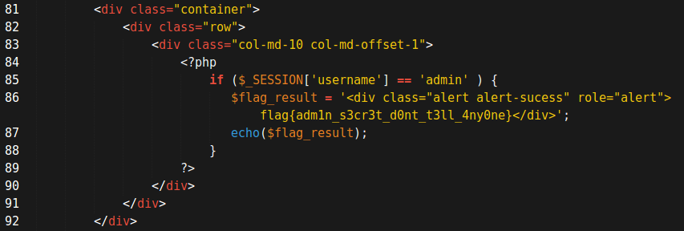
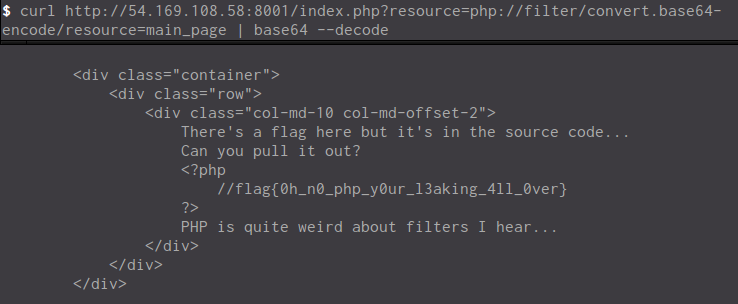
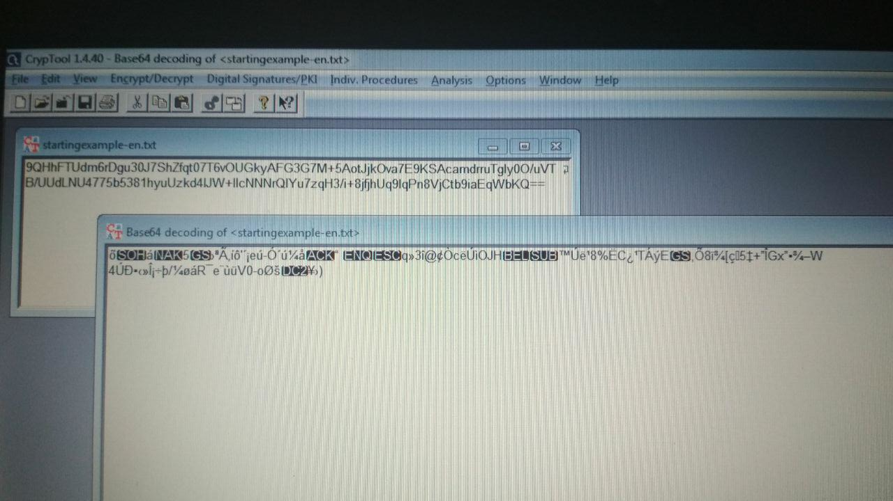
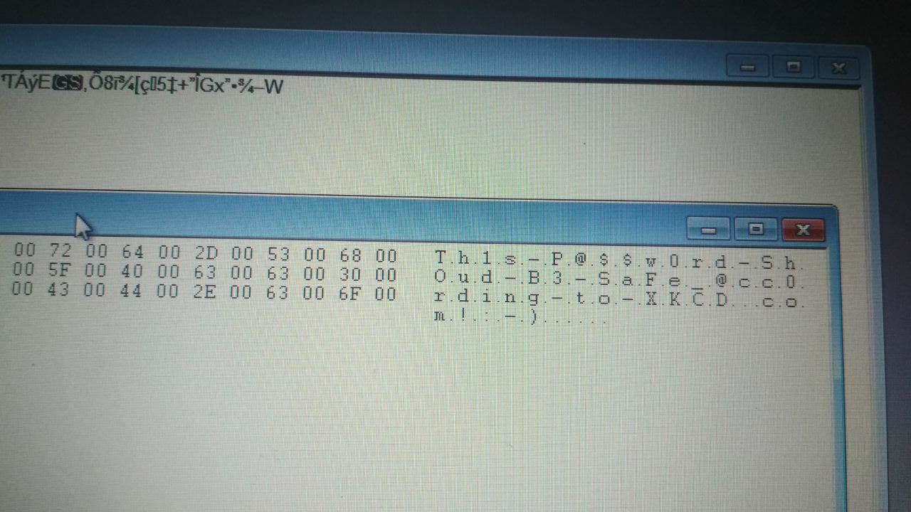
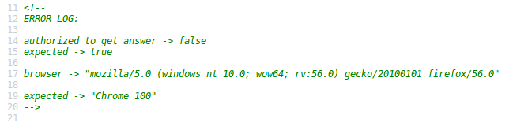
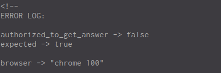
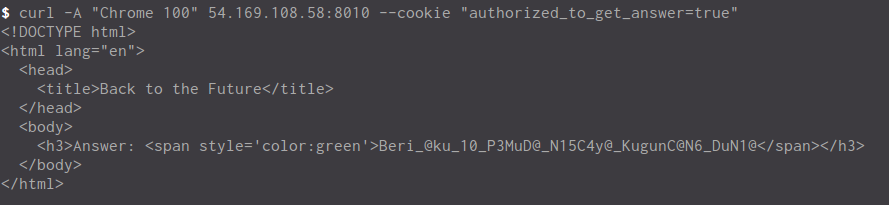

# CTF DISINFOLAHTAD Write-Ups
Write-up ini ditulis dalam Bahasa Indonesia.  
\* This write-up are written in Bahasa.

## Tim
Nama: hahaha111  
Anggota:
* Melki Mario Gulo \<<melkimariogulo@gmail.com>\>
* David Adi Nugroho \<<davidadi216@gmail.com>\>

## Web

### PHP yang Bertabrakan
Poin: 100

#### Soal
Bagaimana scara saya membuat dua benda sama satu lain tanpa harus benar-benar menjadi sama ke sesamanya?
```php
<?php
    if (isset($_GET['guess'])){
        if ($_GET['guess'] === "0e1234") {
            echo('<h3> NOOOOOO ANYYYTHING BUT THAAAAAT </h3>');
        } else if ($_GET['guess'] == "0e1234") {
            echo(file_get_contents("flag.txt"));
        } else {
            echo("<h3> Thats not what I'm thinking </h3>");
        }
    }
?>
```
[Link][1]

#### Penyelesaian
Dalam source kode terlihat 2 perbandingan yang membandingkan `$_GET['guess']` dengan `0e1234`. Yang pertama menggunakan 3 sama dengan (`===`) dan yang kedua menggunakan 2 sama dengan (`==`). Bila dilihat dari kerentanan php, karakter `0e1234` apabila dibandingkan dengan angka `0` yang menggunakan jenis 2 sama dengan (`==`) maka akan bernilai `true`. Sehingga untuk mendapatkan flag perlu mengakses dengan link seperti berikut:

`http://54.169.108.58:6464/index.php?guess=0`

#### Flag
flag{ju5t_5ome_r4ndom_php_th1ngs}

### Pintu Masuk Raja
Poin: 200

#### Soal
Dapatkah Anda login sebagai Admin?  

File yang dibutuhkan: [src.zip][3]  

[Link][2]

#### Penyelesaian
Setelah dibuka kode program dan dilihat pada file `profiles.php` terlihat flag terdapat pada baris ke 86.



#### Flag
flag{adm1n_s3cr3t_d0nt_t3ll_4ny0ne}

### Komparasi String
Poin: 300

#### Soal
Dapatkah Anda menemukan kata kunci yang benar?

* [src.html][4]: sumber kode dari aplikasi

[Link][5]

#### Penyelesaian
Pada file `src.html` ketika dibuka terdapat kode php seperti berikut:

```php
<?php
if( isset($_GET['passphrase'])){
    $passphrase = ???;
    $flag = ???;
    if (strcasecmp($_GET['passphrase'], $passphrase) == 0 )){
        echo $flag;
    }
}
?>
```

Dalam kode terdapat fungsi `strcasecmp` yang pada dasarnya sangat rawan untuk dilakukan pengecohan. Untuk mengecoh fungsi `strcasecmp`, menggunakan data bertipe `array` sebagai masukan untuk `$_GET['passphrase']`. Sehingga untuk mendapatkan flag perlu mengakses dengan link seperti berikut:

`http://54.169.108.58:12345/?passphrase[]=???`

#### Flag
flag{4rr4ys_4re_al5o_5tring5}

#### Situs yang bocor

#### Soal
Diperlihatkan kode program untuk `index.php`

```php
<?php
    if(isset($_GET['resource'])){
        include($_GET['resource'] . '.php');
    } else {
        header("Location: /index.php?resource=main_page");
    }
?>
```

[Link][6]

#### Penyelesaian
Ketika melihat kode program, terdapat fungsi `include` yang mempunyai kerentanan terhadap *Local File Inclusion*.

Salah satu *LFI* yang bisa digunakan adalah menggunakan `php://filter`.

Berikut ini untuk melihat isi `main_page` yang akan di encode ke *base64*:

`http://54.169.108.58:8001/index.php?resource=php://filter/convert.base64-encode/resource=main_page`

Setelah di decode akan terlihat flag nya



#### Flag
flag{0h_n0_php_y0ur_l3aking_4ll_0ver}

## Forensic

### Gurita Besar dari Pasifik
Poin: 200

#### Soal
Diberikan sebuah file `Group Policy` yang berbentuk `.xml`

```xml
<?xml version="1.0" encoding="utf-8"?>
  <Groups clsid="{3125E937-EB16-4b4c-9934-544FC6D24D26}">
    <User clsid="{DF5F1855-51E5-4d24-8B1A-D9BDE98BA1D1}"
     name="ladmin_gpo" image="0" changed="2012-02-03 07:10:48"
     uid="{FE47E73C-7525-46CD-B2E0-F68D3022EDCE}">
      <Properties action="C" fullName="Local admin created by GPO"
       description=""
       cpassword="9QHhFTUdm6rDgu30J7ShZfqt07T6vOUGkyAFG3G7M+5AotJjkOva7E9KSAcamdrruTgly0O/uVTB/UUdLNU4775b5381hyuUzkd4lJW+llcNNNrQlYu7zqH3/i+8jfjhUq9lqPn8VjCtb9iaEqWbKQ"
       changeLogon="0" noChange="0" neverExpires="0"
       acctDisabled="0" userName="ladmin_gpo"/>
    </User>
    <Group clsid="{6D4A79E4-529C-4481-ABD0-F5BD7EA93BA7}"
     name="Administrators (built-in)" image="2"
     changed="2012-02-06 10:45:50"
     uid="{4D0CE71D-D2E4-42B1-9BF3-147C910A15F1}">
      <Properties action="U" newName="" description=""
       deleteAllUsers="0" userAction="ADD" deleteAllGroups="0"
       removeAccounts="0" groupSid="S-1-5-32-544"
       groupName="Administrators (built-in)">
        <Members>
          <Member name="ladmin_gpo" action="ADD" sid=""/>
        </Members>
      </Properties>
    </Group>
  </Groups>
```

File `.xml` tersebut adalah file Group Policy Widows `GPO_local_accounts` yang rentan terhadap pencurian password. Password terletak pada `cpassword`. Password tersebut ter-enkripsi AES-256 yang cukup kuat, namun public-key dari enkripsi tersebut dapat dilihat di [sini][8] sehingga dapat di-decrypt dengan mudah.

\*Gunakan tools `CrypTool 1.4` untuk mempermudah decrypt.

Tambahkan `==` diakhir `cpassword` dan decode dari `base64`



Kemudian decrypt dari AES-256 dengan public-key dari [sini][8]. Dan akan terlihat flagnya



#### Flag
Th1s-P@$$w0rd-ShOud-B3-SaFe_@cc0rding-to-XKCD.com!:-)

Terima kasih untuk:
[https://blog.compass-security.com/2012/04/exploit-credentials-stored-in-windows-group-policy-preferences/][9]

### Kembali ke Masa Depan
Poin: 500

#### Soal

[Link][7]

#### Penyelesain
Ketika link dibuka maka akan tampil informasi bahwa browser kita tidak up-to-date dan kita tidak terautentifikasi untuk mendapatkan jawaban.

Dilihat dari lognya seperti berikut:


Agar browser kita menjadi `Chrome 100` maka kita harus mengubah User-Agent nya.

Perintah curl untuk mengubah User-Agent adalah seperti berikut:

```bash
$ curl -A "Chrome 100" http://54.169.108.58:8010
````

Maka log akan berbeda, tetapi kita belum terautentifikasi:



Ketika dilihat header yang diterima, terlihat bahwa `Set-Cookie: authorized_to_get_answer=false`. Maka kita harus secara manual mengganti cookie `authorized_to_get_answer` menjadi `true`.

Berikut perintah curl-nya:

```bash
$ curl -A "Chrome 100" 54.169.108.58:8010 --cookie "authorized_to_get_answer=true"
```

Maka akan terlihat flag-nya:


#### Flag
Beri_@ku_10_P3MuD@_N15C4y@_KugunC@N6_DuN1@


[1]:http://54.169.108.58:6464/
[2]:http://54.169.108.58:8004/
[3]:http://13.250.51.75:8000/files/97eb3592f89c949b132b58f127dbf8a7/src.zip
[4]:http://13.250.51.75:8000/files/0facb3281fb3f4d34e626626b7ec31db/src.html
[5]:http://54.169.108.58:12345/
[6]:http://13.250.51.75:8000/
[7]:http://54.169.108.58:8010/
[8]:http://msdn.microsoft.com/en-us/library/cc422924(PROT.10).aspx
[9]:https://blog.compass-security.com/2012/04/exploit-credentials-stored-in-windows-group-policy-preferences/